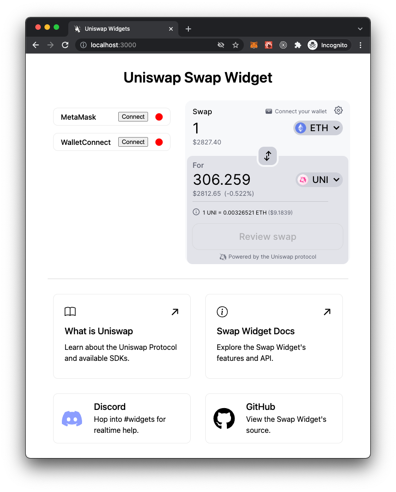

This is a [Next.js](https://nextjs.org/) project bootstrapped with [`create-next-app`](https://github.com/vercel/next.js/tree/canary/packages/create-next-app) to showcase how to integrate the @uniswap/widgets package in your own projects.

## widgets-next



---

To start the demo:

```bash
yarn        # install dependencies
yarn dev    # run the development server
# or
npm         # install dependencies
npm run dev # run the development server
```

Navigate to [http://localhost:3000](http://localhost:3000) to see the widget.

---

The `SwapWidget` component is passed everything it needs to render:

- `jsonRpcEndpoint`: a JSON-RPC endpoint, in this case "https://cloudflare-eth.com"
- `tokenList`: a TokenList, in this case "https://gateway.ipfs.io/ipns/tokens.uniswap.org"
- `provider`: an EIP1193 Provider, or an `@ethersproject` `Web3Provider`, in this case from `connectors.ts`

In addition, it is passed these optional props to flesh out the demo:

- `locale`: the locale in which to render, in this case "en-US"
- `onConnectWallet`: a callback to invoke when a user clicks "Connect your wallet"
- `defaultInputTokenAddress`: the default input token address, or "NATIVE" for Ether
- `defaultInputAmount`: the default input token amount
- `defaultOutputTokenAddress`: the default output token amount, in this case the address of the Uniswap (UNI) token

For all available props (including theming), refer to the documentation at https://docs.uniswap.org/sdk/widgets/swap-widget.

### Passing a provider

This project uses [@web3-react](https://github.com/NoahZinsmeister/web3-react) to connect to an Ethereum Provider. The demo uses both MetaMask and WalletConnect. See `components/Web3Connectors.tsx`.

The `SwapWidget` component will accept any EIP1193 Provider or `@ethersproject` `Web3Provider`, so you are not limited to using `@web3-react`. If you _do_ use a `Web3Provider`, you can pass it in the same way, to the widget's `provider` prop.

### Localization

The `SwapWidget` component will render in whichever supported locale is passed to the `locale` prop. The demo uses en-US, but includes a selector to demonstrate additional locales.

### Additional documentation

- [What is Uniswap](https://docs.uniwap.org/)
  Learn about the Uniswap Protocol and available SDKs.

- [Swap Widget Docs](https://docs.uniswap.org/sdk/widgets/swap-widget)
  Explore the Swap Widget's features and API.

- [Discord](https://discord.gg/ybKVQUWb4s)
  Hop into #widgets for realtime help.

- [GitHub](https://github.com/Uniswap/interface/blob/main/src/lib/index.tsx)
  View the Swap Widget's source.
